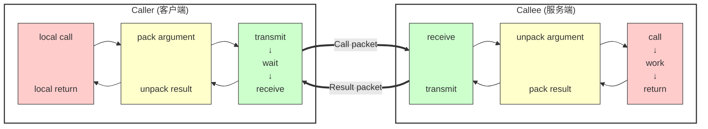

# RPC通信框架-学习项目

## 项目介绍
```text
简单的rpc框架学习项目，使用protobuf、muduo等组件
```
### RPC通信原理



## 环境依赖

```
ubuntu 22.04
boost 1.174.0
muduo 2.0.2
zookeeper 3.4.13
```

## 目录结构

```
├── config  // 配置文件目录
├── example // 调用远程函数客户端和提供远程函数服务端函数示例
├── src     // rpc框架代码
│  ├── include    // rpc框架头文件目录
├── autobuild.sh  // 编译脚本
└── README.MD     // 代码说明
```

